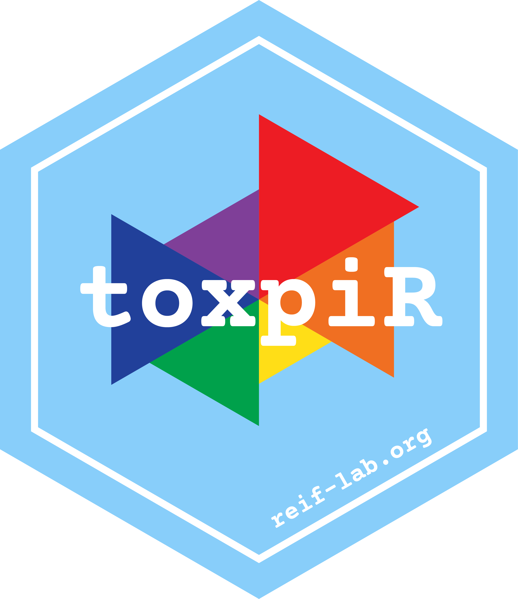

# toxpiR 

<!-- badges: start -->
  [](https://www.repostatus.org/#active)
  [](https://github.com/ToxPi/toxpiR/actions)
  [](https://cran.r-project.org/web/packages/toxpiR/index.html)
  [](https://cranlogs.r-pkg.org/badges/grand-total/toxpiR)
  [](https://codecov.io/gh/ToxPi/toxpiR)
<!-- badges: end -->

R package for the Toxicological Priority Index (ToxPi) prioritization algorithm. Package developed and maintained by the [Reif Lab](http://reif-lab.org). 

### Installation

Current stable release:

```r
install.packages("toxpiR")
```

Build from GitHub (current stable release):

```r
if (!require(remotes)) install.packages("remotes")
remotes::install_github("ToxPi/toxpiR", 
                        dependencies = TRUE, 
                        build_vignettes = TRUE)
```

Build from GitHub (current dev version):

```r
if (!require(remotes)) install.packages("remotes")
remotes::install_github("ToxPi/toxpiR",
                        ref = dev,
                        dependencies = TRUE, 
                        build_vignettes = TRUE)
```
