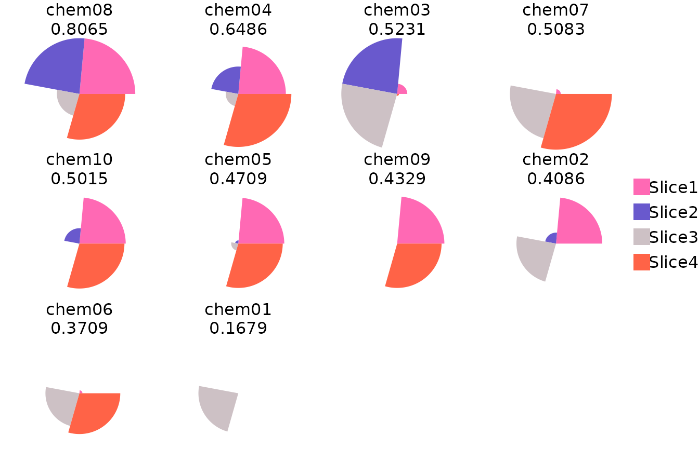
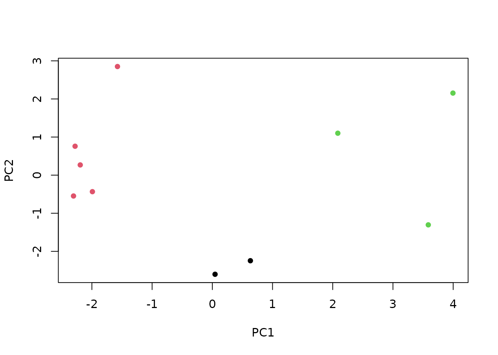

# Import ToxPi GUI Files

This vignette will show how to load a data file that was saved using the
ToxPi Java GUI, which can be downloaded from [here](https://toxpi.org/).
The ToxPi Java GUI will save data files using file format “C” described
in the ToxPi User Manual. This vignette will use the “format_C.csv” file
to demonstrate how to import GUI data.

``` r
library(toxpiR)

## Create a tempfile and download 'format_C.csv'
fmtc <- tempfile()
ghuc <- "https://raw.githubusercontent.com"
fmtcUrl <- file.path(ghuc, "ToxPi", "ToxPi-example-files", "main", "format_C.csv")
download.file(url = fmtcUrl, destfile = fmtc, quiet = TRUE)
```

The “format_C.csv” model specification reuses metrics across different
slices. In general, we do not recommend duplicating inputs across
slices, so the user gets a warning when creating a model with duplicate
inputs.

``` r
## Import file into R
gui <- txpImportGui(fmtc)
#> Warning in method(object): The following 'input' columns are duplicated in the model:
#>     metric3, metric2, metric3, metric1, metric2
```

The resulting `list` object contains: `$model`, a `TxpModel` object with
the model specifications; `$input`, a `data.frame` containing the data
for calculating ToxPi scores; and `$fills`, an array of slice colors for
plotting.

``` r
gui$model
#> TxpModel with 4 slices.
#>   txpSlices(4): Slice1 Slice2 Slice3 Slice4
#>   txpWeights(4): 4 4 4 5
#>   txpTransFuncs(4): NULL NULL NULL NULL
gui$input
#>    Row   Source       CASRN   Name metric1 metric2 metric3 metric4
#> 1    1 source01 11-111-1111 chem01      25      91      NA      NA
#> 2    2 source02 22-222-2222 chem02      NA      46      51      48
#> 3    3 source03 33-333-3333 chem03      44      NA       9      34
#> 4    4 source04 44-444-4444 chem04      26      64      27       9
#> 5    5 source05 55-555-5555 chem05      33      36      69      88
#> 6    6 source06 66-666-6666 chem06      94      46      NA      54
#> 7    7 source07 77-777-7777 chem07      37      31      NA       7
#> 8    8 source08 88-888-8888 chem08      58      29       9      46
#> 9    9 source09 99-999-9999 chem09      95      24      78      46
#> 10  10 source10 11-222-3333 chem10      68      54      43      25
gui$fills
#> [1] "#FF69B4" "#6959CD" "#CDC1C5" "#FF6347"
```

We calculate ToxPi scores using the `txpCalculateScores` function, which
takes a model and input `data.frame`. Note that by default the ToxPi GUI
does not accept negative values. However, the package keeps them by
default. To replicate the GUI functionailty, we set
`negative.value.handling = "missing"`.

``` r
## Calculate ToxPi scores
res <- txpCalculateScores(model = gui$model, input = gui$input, id.var = "Name",negative.value.handling = "missing")

## Overall ToxPi scores
txpScores(res)
#>         1         2         3         4         5         6         7         8 
#> 0.1679363 0.4085540 0.5230658 0.6485548 0.4709411 0.3709372 0.5082931 0.8065481 
#>         9        10 
#> 0.4328831 0.5015004

## Slice scores
txpSliceScores(res, adjusted = FALSE)
#>        Slice1     Slice2     Slice3      Slice4
#> 1  0.00000000 0.00000000 0.71372906 0.000000000
#> 2  0.82792881 0.19675216 0.70869704 0.002381066
#> 3  0.18129307 1.00000000 1.00000000 0.033389421
#> 4  0.85188671 0.49126173 0.22527793 0.950345105
#> 5  0.82344996 0.05677389 0.12681807 0.795566352
#> 6  0.05345762 0.00000000 0.60857479 0.731560510
#> 7  0.08438215 0.00000000 0.82586349 1.000000000
#> 8  1.00000000 1.00000000 0.40340351 0.819540604
#> 9  0.84561468 0.00000000 0.00000000 0.795310761
#> 10 0.82873456 0.27576432 0.01947655 0.805920923
```

A results output similar to that given by the Java GUI can be obtained
by combining score components.

``` r
out <- as.data.frame(res, adjusted = FALSE)
out <- out[order(out$score, decreasing = TRUE), ]
out
#>        id     score rank     Slice1     Slice2     Slice3      Slice4
#> 8  chem08 0.8065481    1 1.00000000 1.00000000 0.40340351 0.819540604
#> 4  chem04 0.6485548    2 0.85188671 0.49126173 0.22527793 0.950345105
#> 3  chem03 0.5230658    3 0.18129307 1.00000000 1.00000000 0.033389421
#> 7  chem07 0.5082931    4 0.08438215 0.00000000 0.82586349 1.000000000
#> 10 chem10 0.5015004    5 0.82873456 0.27576432 0.01947655 0.805920923
#> 5  chem05 0.4709411    6 0.82344996 0.05677389 0.12681807 0.795566352
#> 9  chem09 0.4328831    7 0.84561468 0.00000000 0.00000000 0.795310761
#> 2  chem02 0.4085540    8 0.82792881 0.19675216 0.70869704 0.002381066
#> 6  chem06 0.3709372    9 0.05345762 0.00000000 0.60857479 0.731560510
#> 1  chem01 0.1679363   10 0.00000000 0.00000000 0.71372906 0.000000000
```

ToxPi images and overall score rank plot can also be produced.

``` r
plot(sort(res), fills = gui$fills)
```



``` r
plot(res, txpRanks(res))
```


``` r
plot(res, txpRanks(res), labels = 1:10, pch = 16, size = grid::unit(0.75, "char"))
```


The basic clustering methods offered in the Java GUI can also be
recreated.

``` r
## Hierarchical Clustering
hc <- hclust(dist(txpSliceScores(res)), method = 'complete')
plot(hc, hang = -1, labels = txpIDs(res), xlab = 'Name', sub = '')
```


``` r
## K-Means Clustering, plotted using principal components
nClusters <- 3
km <- kmeans(txpSliceScores(res), nClusters)
pc <- prcomp(txpSliceScores(res))
coord <- predict(pc) * -sum(txpWeights(res))
plot(coord[,1], coord[,2], col = km$cluster, 
     xlab = 'PC1', ylab = 'PC2', pch = 16)
```


