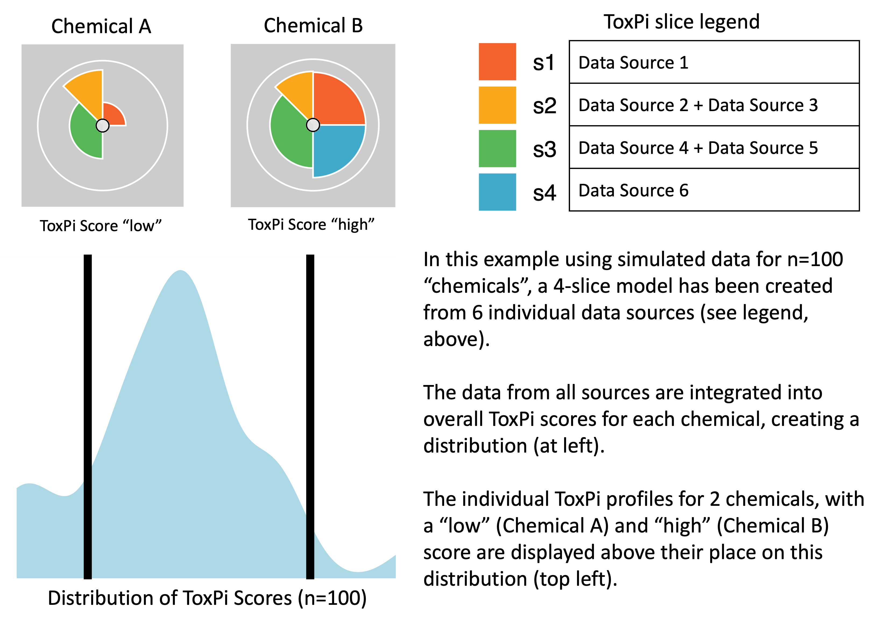
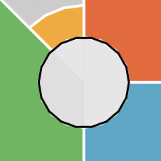

# toxpiR Introduction

## Introduction

This document introduces ToxPi and describes how to use the `toxpiR`
package to easily import, recombine, analyze, and visualize high
dimensional data. The `toxpiR` package is an R implementation of ToxPi
that offers new features over what was previously available for data
handling, recombination, and customization; provides formally packaged,
open-source code for ToxPi; extends the application domain by supporting
rapid analysis of massive datasets; and bridges with the stand-alone,
[Graphical User Interface (GUI)](https://toxpi.org) Java application and
[ArcGIS Toolkit](https://github.com/ToxPi/ToxPi-GIS).

## What is ToxPi?

The Toxicological Prioritization Index (ToxPi) is a statistical modeling
framework that allows transparent integration and visualization of data
across disparate sources (i.e. multimodal or multiscale information).
This framework aggregates related features into scored ‘slices’,
rescales individual slice scores to range 0–1, and then develops an
overall score for each sample using a weighted model. The slice weights
can be interpreted as the “importance” of categorized features when
predicting sample scores and associated ranks. The resulting scores for
each sample are visualized as ToxPi profiles (see image below). Slice
weights are represented as the arc-width, slice scores are represented
as the radius, and the overall sample scores are represented by the
combination of slice weights and radii. These visualizations allow for
quick comparison of overall feature importance, feature impacts driving
a specific sample, relative impact ranking of common features between
samples, and overall ranking between samples. As a flexible method
capable of integrating data from any source, it has been applied to
problems in several different fields. Additional information is linked
from [toxpi.org](https://toxpi.org).



## Outline

There are three main steps in using this package:

- **Loading data**: Users can load comma-separated value (csv) formatted
  data where data features that will make up the slices are stored as
  columns and attributes are rows. If you are more famililar with the
  GUI data format, the package also has a function to load data that is
  formatted in any one of the GUI layouts where slice information is
  presented in rows beginning with a hash tag(#). However, new users
  should use a simple .csv file with the row and column layout.

- **Creating ToxPi Model**: ToxPi model can be created by specifying
  information about each slice and its corresponding weights. Each slice
  can be made up of one or more features from the input data. You should
  also name the slices and provide their weights in this step.

- **Computing ToxPi Scores**: Scores can be computed per attribute as
  well as for each slice. The S4 object resulting from this step will
  combine and store the ToxPi model and scores all in one place. This
  final object will contain all the information needed for plotting.

Data contained within different slots of the S4 objects created using
this package can be obtained using *accessor functions*. More details on
how this can be done is present later in the document.

## Installation

### **Standard installation**

You can install `toxpiR` from
[CRAN](https://cran.r-project.org/web/packages/available_packages_by_name.html)
with:

``` r
install.packages("toxpiR")
```

### **Installation from GitHub**

Any new features will be first added to the GitHub version of the
package. However, it may be less stable than the release on CRAN. Before
attempting a direct installation from GitHub, please make sure you have
`devtools` package on your system. Note, Windows users will need Rtools
to install directly from GitHub.

``` r
remotes::install_github("ToxPi/toxpiR")
```

## **Launching package in R**

``` r
library(toxpiR)
```

## Flowchart


This flowchart details the basic steps necessary to analyze data using
`toxpiR`. A separate vignette describes how to load and work with the
GUI data file using txpImportGui() function. Usage for all other
functions is described below using an example data set. To view a list
of all functions available in this package, please run:

> lsf.str(“package:toxpiR”)

## Example usage

Data can either be entered as a regular csv file without the header
lines specifying slice information, or in one of the GUI input formats.
If you are using the GUI format, please refer to the [Import ToxPi GUI
files](https://cran.r-project.org/package=toxpiR/vignettes/importFromGui.html)
vignette.

The standard data input is a standard R dataframe with rows as your
datapoints and columns as features that may be turned into ToxPi slices.
A simple example data set called *txp_example_input* is available within
the package. We will use this 10 x 8 toy data to walk through a simple
analysis and explain the functions available in this package. These
metrics that we have specified can be in completely different scales and
data type, but first we will show a simple example of the package usage.

### Load the dataset

``` r
data(txp_example_input, package = "toxpiR")
head(txp_example_input)
#>     name metric1 metric2 metric3 metric4 metric5 metric6 metric7 metric8
#> 1 chem01      74      77      25      74      77      97      25      77
#> 2 chem02      28      20      72      28      20      68      72      20
#> 3 chem03      61       3      73      61       3      24      73       3
#> 4 chem04      NA      40      20      NA      40      22      20      40
#> 5 chem05      29      53      44      29      53       4      44      53
#> 6 chem06      12      43      83      12      43      85      83      43
```

### Specify slice information

The first step is to specify information about each slice before
creating a Toxpi model. This can be done using the **TxpSliceList()**
and **TxpSlice()** functions. These slices can be made up of one or more
features from the input dataset and are specified by listing the
features that go into each slice in the **TxpSlice()** function. We can
also specify how we want to transform the slices with the
**TxpTransFuncList()** function. This means we can do a different
transformation per slice instead of having to transform the entire input
dataset.

#### TxpSlice(txpValueNames, txpTransFuncs)

> Store individual slice objects.

**Arguments**

> *txpValueNames* : character vector indicating which data to include in
> the slice. Can just be the name of a single column if that is all the
> slice contains.

> *txpTransFuncs* : List of transformation functions to use with one
> function per entry in txpValueNames. Can be created using
> TxpTransFuncList() method. Defaults to NULL.

#### TxpSliceList()

> Method to merge all individuals slices together and assign slice
> names.

**Basic Usage**

``` r

## Goal - Create two slices with transformation functions 
# Slice 1: Metric 1, No transformation 
# Slice 2: Metric 2 (square) and Metric 3 (no transformation)

slice2.trans <- TxpTransFuncList(func1 = function(x) x^2, func2 = NULL)

f.slices <- TxpSliceList(Slice1 = TxpSlice("metric1"), 
                         Slice2 = TxpSlice(c("metric2", "metric3"), 
                                           txpTransFuncs = slice2.trans ))
```

### Create ToxPi model

The ToxPi model object is core for specifying how the created slices
should behave when the scores are calculated. In this step, we need to
specify what the slices we created above are and assign those slices
weights. We can also assign transformation functions at this step.
However, it is not necessary if you have already done so when creating
the slices. The model is a core component of the analysis because it is
going to specify how our calculations are performed.

#### TxpModel()

**Arguments**

> *txpSlices* : TxpSliceList() object.

> *txpWeights* : numeric vector specifying weight of each slice. By
> default, all slices are weighted equally (1).

> *txpTransFuncs* : TxpTransFuncList object. Defaults to NULL, if a list
> is provided, its length must be equal to the number of slices present.

> adjusted : Scalar logical to adjust returned weights such that they
> sum to 1.

**Usage**

``` r

## Goal - Create ToxPi model.
# Slice 1, weight = 2
# Slice 2, weight = 1, apply log transform to final value. 

# Object storing list of transformation functions.
final.trans <- TxpTransFuncList(f1 = NULL, f2 = function(x) log10(x)) 

f.model <- TxpModel(txpSlices = f.slices, 
                    txpWeights = c(2,1),
                    txpTransFuncs = final.trans)
```

### Calculate ToxPi scores

Calculate ToxPi Scores for the given ToxPi model and input data. This
input data is what we read in previously from either a standard .csv
file or a GUI compatible one. This step uses the model we have created
to specify how the ToxPi scores should be calculated. The results object
that is created also stores the model used, allowing for easy reference
when you are dealing with many models and results.

#### txpCalculateScores()

**Arguments**

> *model* : ToxPi model object created using TxpModel() function.

> *input* : dataframe containing input data for ToxPi model.

> *id.var* : Character scalar, column in ‘input’ to store in. Deafults
> to NULL.

> *rank.ties.method* : character string specifying how ties are treated.
> Available options “average”, “first”, “last”, “random”, “max” and
> “min”. Pased to base::rank function.

> *negative.value.handling* : character string specifying how negative
> values are treated. Available options are “keep” and “missing”.
> Defaults to keep.

**Usage**

``` r
f.model <- txp_example_model #Load a more complex 4 slice model
f.results <- txpCalculateScores(model = f.model,
                                input = txp_example_input,
                                id.var = 'name' ) 

txpSliceScores(f.results) #ToxPi scores
#>               s1          s2         s3         s4
#>  [1,] 0.25000000 0.009920635 0.37500000 0.22839506
#>  [2,] 0.03893443 0.103174603 0.22026699 0.05246914
#>  [3,] 0.07172131 0.105158730 0.17111650 0.00000000
#>  [4,] 0.02254098 0.000000000 0.02730583 0.11419753
#>  [5,] 0.10860656 0.047619048 0.11468447 0.15432099
#>  [6,] 0.05327869 0.125000000 0.28398058 0.12345679
#>  [7,] 0.00000000 0.000000000 0.00000000 0.00000000
#>  [8,] 0.19467213 0.099206349 0.23118932 0.19444444
#>  [9,] 0.21721311 0.075396825 0.22936893 0.25000000
#> [10,] 0.14549180 0.023809524 0.18750000 0.11419753
txpWeights(f.results) #Print weights
#> [1] 2 1 3 2
txpMissing(f.results) #Proportion of missing data within each slice
#>    s1    s2    s3    s4 
#> 0.100 0.100 0.125 0.100
```

### Visualization

Two paths exist for visualization, **ggplot** methods and **grid**
methods. The ggplot method uses the `ggplot2` package and allows for
highly customizable profiles allowing for several visualization
experiences. The grid method uses advanced `grid` graphics and can be
implemented using pieGrob objects that are compatible with the grid
system. Additional plots can be made such as a rank plot by using the
data stored in the results object. The results object also allows for
the flexibility to use other R plotting packages if preferred.

  
**Summary**: The ggPlot graphics path will be the best option for users
wanting to create ToxPi profiles, with many options for customization.
The grid graphics path is for users wanting to modify very specific,
basic elements of ToxPi profiles and/or recombine profiles with other
graphics. The `ggplot2` package (high-level) is built atop `grid`
graphics (low-level), so the two systems interact well.

### ggPlot

- Examples shown in this vignette produce a “look-and-feel” that is
  closer to the graphics output of the familiar [ToxPi
  GUI](https://toxpi.org)
- Aesthetics are easy to customize
- Includes missing data visuals (center circle à la ToxPi GUI output)

### grid

- Formal, S4-based customization options for visuals using the R `grid`
  package and the “grob” (grid graphical object) framework
- ToxPi profile graphics created as grobs can be directly inserted into
  more complex figures as points on a scatterplot, leaves on a cluster
  dengrogram, overlaid on a map, etc.
- Vignette examples show how to highlight individual profiles and
  highlight individual slices

#### ggplot Method

This method uses the `ggplot2` package to draw highly customizable ToxPi
profiles with multiple different aesthetics and information options. The
most notable aesthetic addition is the inclusion of information
regarding the amount of missing data each slice has, which is
represented by the a small circle of interior slices as is shown in
profiles generated by the ToxPi GUI. Each interior slice is colored on a
grey scale, with black representing all missing data and white
representing no missing data. Each new customization option, along with
some other notable differences, are described below.

  
**Customization Options (Arguments)**

> *fills* : Vector containing slice colors. Defaults to a color scheme
> matching the ToxPi GUI.

> *showMissing* : Boolean to show missing data information. Defaults to
> TRUE.

> *showCenter* : Boolean to show inner circle. Defaults to TRUE. FALSE
> overrides showMissing.

> *showScore* : Boolean to show overall profile scores. Defaults to
> TRUE.

> *ncol* : Integer specifying number of columns in plot. Default is an
> automatic calculation by ggplot.

> *bgColor* : Text specifying background color for profiles as either
> hex codes or R recognized colors. Defaults to “gray80”.

> *borderColor* : Text specifying color of max radius ring as either hex
> codes or R recognized colors. Defaults to “white”.

> *sliceBorderColor* : Text specifying color of slice borders as either
> hex codes or R recognized colors. Defaults to “white”.

> *sliceValueColor* : Text specifying color of slice scores as either
> hex codes or R recognized colors. Defaults to NULL.

> *sliceLineColor* : Text specifying color of slice guidelines as either
> hex codes or R recognized colors. Defaults to NULL.

  
**Usage**

Depending on export method, plot resolution may end up poor. SVG and PDF
images tend to produce better results than PNG. Usage and example plot
output are shown below.

``` r
library("ggplot2")

# Default plot
plot(f.results, package = "gg") # Using ggplot package
```


Sometimes the inner circle of the ToxPi figure can show plotting
artifacts. A possible workaround for this is to create a wrapper
function around `ggplot2:::coord_munch` as shown below.

``` r
## Optional code to make smoother lines

# Plot before updating coord_munch
plot(f.results["chem01"], package = "gg") 

# Save the original version of coord_munch
coord_munch_orig <- ggplot2:::coord_munch

# Make a wrapper function that has a different default for segment_length
if (length(formals(coord_munch_orig)) == 5) {
  coord_munch_new <- function(coord, data, range, segment_length = 1/1000,
                              is_closed = FALSE) {
    coord_munch_orig(coord, data, range, segment_length, is_closed)
  }
} else {
  coord_munch_new <- function(coord, data, range, segment_length = 1/1000) {
    coord_munch_orig(coord, data, range, segment_length)
  }
}

# The environment may need to be set
#environment(coord_munch_new) <- environment(coord_munch_orig)

# Replace ggplot2:::coord_munch with coord_munch_new
assignInNamespace("coord_munch", coord_munch_new, ns = "ggplot2")

# Plot after updating coord_munch
plot(f.results["chem01"], package = "gg") 

# Revert to original coord_munch ater plotting if desired 
#assignInNamespace("coord_munch", coord_munch_orig, ns = "ggplot2")
```



  
**Customization examples**

#### Coloration Options

``` r
# Changing the slice colors
colors <- c("orange", "green", "magenta", "lightblue")
plot(f.results["chem02"], package = "gg", fills = colors)
plot(f.results["chem02"], package = "gg", fills = NULL)
```


``` r
# Changing the background color
plot(f.results["chem02"], package = "gg", bgColor = "lightskyblue")
plot(f.results["chem02"], package = "gg", bgColor = NULL)
```


``` r
# Changing the max radius ring color
plot(f.results["chem02"], package = "gg", borderColor = "black")
plot(f.results["chem02"], package = "gg", borderColor = NULL)
```


``` r
# Changing the slice border color
plot(f.results["chem02"], package = "gg", sliceBorderColor = "magenta")
plot(f.results["chem02"], package = "gg", sliceBorderColor = NULL)
```


``` r
# Adding slice guidelines 
plot(f.results["chem02"], package = "gg", sliceLineColor = "red")
plot(f.results["chem02"], package = "gg", sliceLineColor = NULL) 
```


``` r
# Adding visible slice scores
plot(f.results["chem02"], package = "gg", sliceValueColor = "brown")
plot(f.results["chem02"], package = "gg", sliceValueColor = NULL)
```


#### Binary Options

``` r
# Hiding inner circle
plot(f.results["chem02"], package = "gg", showCenter = TRUE)
plot(f.results["chem02"], package = "gg", showCenter = FALSE)
```


``` r
# Hiding missing data information (pure white inner circle)
plot(f.results["chem02"], package = "gg", showMissing = TRUE)
plot(f.results["chem02"], package = "gg", showMissing = FALSE)
```


``` r
# Hiding the overall profile scores
plot(f.results["chem02"], package = "gg", showScore = TRUE)
plot(f.results["chem02"], package = "gg", showScore = FALSE) 
```


#### Format/Theme Options

``` r
# Specifying the number of columns in the plot
plot(f.results, package = "gg", ncol = 5) 
```


``` r
# Moving the legend using ggplot built in theme functions
plot(f.results, package = "gg", ncol = 5) + theme(legend.position = "bottom") 
plot(f.results, package = "gg", ncol = 2) + theme(legend.position = "left")
```


``` r
# Removing plot margins
plot(f.results, package = "gg") + theme(plot.margin = margin(0, 0, 0, 0, "cm"))
```


``` r
# Removing spacing between panels
plot(f.results, package = "gg") + theme(panel.spacing = unit(0, "lines"))
```


``` r
# Removing text labels
plot(f.results, package = "gg") + theme(strip.text.x = element_blank())
```


``` r
# A combination of the above for a rank ordered plot
plot(f.results[order(txpRanks(f.results)[1:9])], package = "gg") +
  theme(
    plot.margin = margin(0, 0, 0, 0, "cm"),
    panel.spacing = unit(0, "lines"),
    strip.text.x = element_blank(),
    legend.position = "none"
  )
```


**Missing Data Examples**

``` r
## Creating an example with more variable missing data amounts
f.input <- txp_example_input

# Add more missing data to slice 2 via metric3 in the raw data
f.input[3:10, "metric3"] <- NA

# Modify transformation function for slice 4
txpSlices(f.model)[[4]] <- TxpSlice("metric8", c(fn = \(x) sqrt(x - 30)))

# Calculate new ToxPi results
f.results_missing <- txpCalculateScores(f.model, f.input, id.var = "name")
#> Warning in sqrt(x - 30): NaNs produced

# View missing data proportions
txpMissing(f.results_missing)
#>    s1    s2    s3    s4 
#> 0.100 0.800 0.125 0.300

# View new result profile
plot(f.results_missing["chem02"], package = "gg")
```


#### pieGrob Method

This method is the default and uses the grid package with grob objects
to draw ToxPi profiles that can be individually customized after
plotting. This method does not allow for the wide array of aesthetics as
ggplot does, but instead it allows the user to highlight specific
profiles or slices that have significant importance in their results.
Methods for highlighting information after plotting is shown below.

``` r
library(grid) # Load library
plot(f.results) # ToxPi visuals
```


``` r
# grid.ls() #List grid info

# Highlight one figure using its label
grid.edit("pie-1", fills = c("red", "blue", "black", "brown"))
```


``` r

# Or just one slice in a figure
grid.edit("pie-10::slice1", gp = gpar(fill = "#FC0FC0"))
```


#### ggplot vs grid Comparison

``` r
#Single sample
plot(f.results["chem02"])
plot(f.results["chem02"], package = "gg") 
```


``` r
# Subset plots
plot(f.results[order(txpRanks(f.results))[1:4]]) #Profiles ranked 1-4
plot(f.results[order(txpRanks(f.results))[1:4]], package = "gg") #Profiles ranked 1-4
```


``` r
## Long sample names for cramped plots

#change the first sample name in f.results
txpIDs(f.results)[1] <- "I am a long sample name"

plot(f.results) #grid plot for all samples
plot(f.results, package = "gg") #ggplot for all samples

txpIDs(f.results)[1] <- "chem01" # Change the sample name back
```


``` r
## Long slice names for cramped plots

#change first slice name in model slot
names(f.results@txpModel)[1] <- "long slice name"
#change first slice name in scores slot
colnames(f.results@txpSliceScores)[1] <- "long slice name"
#change first slice name in missing data slot
names(f.results@txpMissing)[1] <- "long slice name"

#plot results using grid
plot(f.results)
#plot results using ggplot
plot(f.results, package = "gg") + theme(
  legend.position = "bottom",
  legend.title = element_text(size = 10),
  legend.text = element_text(size = 6)
)

#change slice name back
names(f.results@txpModel)[1] <- "s1"
colnames(f.results@txpSliceScores)[1] <- "s1"
names(f.results@txpMissing)[1] <- "s1"
```


#### Statistic Plots

``` r
# Rank plot
plot(f.results, y = txpRanks(f.results), labels = 1:10)
```


``` r

# Hierarchical Clustering
f.hc <- hclust(dist(txpSliceScores(f.results)))

plot(f.hc, hang = -1, labels = txpIDs(f.results), xlab = '', sub = '')
```


## Citation

To cite `toxpiR` in your work, please use:
<https://cran.r-project.org/package=toxpiR> (Manuscript currently in
review)
