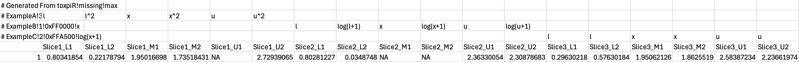

<style type="text/css">
.small-text {
  font-size: 10px;
}
</style>

```{r, include = FALSE}
knitr::opts_chunk$set(
  collapse = TRUE,
  comment = "#>"
)
```

This vignette will show how to save toxpiR data models for sharing and recreation with both the toxpiR package and the Toxpi Java GUI, which can be downloaded from [here](https://toxpi.org/). The txpModel object can be exported along with the data that it is intended to be used on in a specially formatted csv file using *txpExportCSV()*. This is an important step, as it allows easy recreation of both models and results. First this vignette will discuss the toxpiR format, then it will discuss the gui format. The formats have notable differences, and if trying to create a file manually these should be carefully examined.

## txpExportCSV()

**Arguments**

> *model* : ToxPi model object created using TxpModel() function.

> *input* : dataframe containing input data for ToxPi model. 

> *id.var* : Character scalar or integer, column name or index in 'input' that stores unique sample id. Deafults to NULL.

> *fills* : Vector containing slice colors as either hex codes or R recognized colors. Defaults to a color scheme matching the ToxPi GUI.

> *format* : text string specifying whether to format the file for toxpiR or the Java GUI. Options are "toxpiR" and "gui". Default is "toxpiR".

> *fileName* : text string to name the output csv file. Default is "txpModel.csv".

```{r, eval=FALSE}
# Export a data model
txpExportCSV(fileName = "txp_vignette_CI_model.csv", 
             model = txp_example_model_CI, 
             input = txp_example_input_CI)

#Export a data model with a named id column in the input data
txpExportCSV(fileName = "txp_vignette_model.csv", 
             model = txp_example_model, 
             input = txp_example_input, 
             id.var = "name")

#Export a data model with custom slice colors
txpExportCSV(fileName = "txp_vignette_model_fills.csv", 
             model = txp_example_model, 
             input = txp_example_input, 
             id.var = "name", 
             fills = c("blue", "red", "purple", "green"))

#Export a data model for use with the Java GUI; Note: The model is being 
#adjusted first for compatibility with the Java GUI, discussed later
guiModel <- txp_example_model
negativeHandling(guiModel) <- "missing"
txpTransFuncs(guiModel) <- NULL
txpExportCSV(fileName = "txp_vignette_model_gui.csv", 
             model = guiModel, 
             input = txp_example_input, 
             id.var = "name", 
             format = "gui")
```

### toxpiR data model csv format 

toxpiR exported csv files contain a model header that spans several rows followed by the input data. The first column of all header rows starts with a # to denote it is part of the header. The first row contains the format '# Generated From toxpiR!negativeHandling!rankTies' where negativeHandling and rankTies are replaced with their corresponding model parameters. The existence of this row differentiates files formatted for toxpiR from files formatted for the Java GUI. 

The first column in the following header rows each represents a slice from the model. Each slice is formatted as '# sliceName!weight!hexColor!sliceTransformation' where sliceName is the name of the slice, weight is the slice weight in the model, hex color is the hex code of the slice color for plotting, and sliceTransformation is the overall slice transformation of the slice after aggregation. The remaining cells in the header rows represent which metrics are included in the slice, the metric transformation for those metrics, and whether those metrics makeup the main slice, its lower confidence interval, or its upper confidence interval. Any empty cells are defined as not in the slice, any cells with a function of x are defined as in the main level of the slice, any cells with a function of l are defined as in the lower confidence interval of the slice, and any cells with a function of u are defined as in the upper confidence interval of the slice. The metric being included is defined by the column and can be seen at the start of the input data. An example header with one row of data is shown below.

```{r, echo=FALSE, out.width="100%"}

```

### gui data model csv format 

gui exported csv files contain a model header that spans several rows followed by the input data, similar to the toxpiR format, and the first column of all header rows still starts with a # to denote it is part of the header. However; the toxpiR package and ToxPi Java GUI are not directly compatible and there are several key differences to keep in mind, which are represented in the header. The Java GUI can only analyze models with negativeHandling = "missing" and rankTies = "average", thus the first row in the toxpiR format is not contained in the Java GUI format, and the header immediately starts with slice information.

The first column in the header rows still represent slices from the model, but each slice is formatted as '# sliceName!weight!0xColor!metricTransformations' where sliceName is the name of the slice, weight is the integer slice weight in the model, 0xColor is the hex code of the slice color for plotting with # replaced by 0x, and metricTransformations is the common metric transformation across the slice before aggregation and comes from a predefined set of transformations, as the Java GUI isn't compatible with individual metric transformations, overall slice transformations, nor customized functions. While the Java GUI itself is compatible with integer ratio slice weights, this format only accepts integer slice weights. The remaining cells in the header rows still represent which metrics are included in the slice. Any empty cells are defined as not in the slice, and any cells containing text are defined as in the slice. The Java GUI is not compatible with confidence intervals nor individual metric transformations and thus does not treat text as transformations, just metric presence in the slice. The metric being included is defined by the column and can be seen at the start of the input data. An example header with one row of data is shown below.

```{r, echo=FALSE, out.width="100%"}
knitr::include_graphics("embeddedFigures/gui_format.JPG")
```

### Java GUI vs toxpiR Summary

#### Slice Weights
The Java GUI only allows weights that are either integers or a ratio of integers whereas the toxpiR package has no restrictions and can use non-integer values, thus format = "gui" will not work for non-integer numerics.

#### Negative Handling
The Java GUI only allows models with negativeHandling = "missing", thus models with negativeHandling = "keep" will not work for format = "gui".

#### Rank Ties
The Java GUI only allows models with rankTies = "average", thus models with any other rankTies will not work for format = "gui".

#### Confidence Intervals
The Java GUI does not allow user provided confidence interval data, thus models with CI data will not work for format = "gui".

#### Slice Transformations
The Java GUI does not allow for an overall slice transformation that occurs after aggregation, thus toxpiR models with slice transformations will not export at the metric level when format = "gui" but instead will export as post transformed, aggregated slice scores and transformations will be set to linear(x) to ensure consistent results.

#### Metrics Transformations
The Java GUI does not allow for individual metric transformations within a slice, and only allows a small set of predefined functions for its transformations. Thus toxpiR models with metric transformations will be performed immediately, the export will contain transformed metric-level data, and the transformations will be set to linear(x) to ensure consistent results


#### Bootstrapping/Negative Data
The Java GUI does not allow negative input values and will treat them a missing data. This causes a problem if negative values exist after applying any user-defined transformations. If negative values occur within a slice, then all values of that slice will be shifted up by a constant so that no negative values remain. If a slice has both negative transformed values and missing values, then missing values are replaced with the added constant. In this last case, the toxpi and slice scores will be computed correctly, however, the Java GUI should not be used to compute bootstrapped confidence intervals because replacing missing data during the export process will cause the resampling step to be incorrect.

#### Metrics in multiple slices
The Java GUI does not allow multiple columns to have the same name, unless the data in those columns matches exactly. If a toxpiR model includes an input column in multiple slices, then the name will be appended with the slice index for each occurrence.
