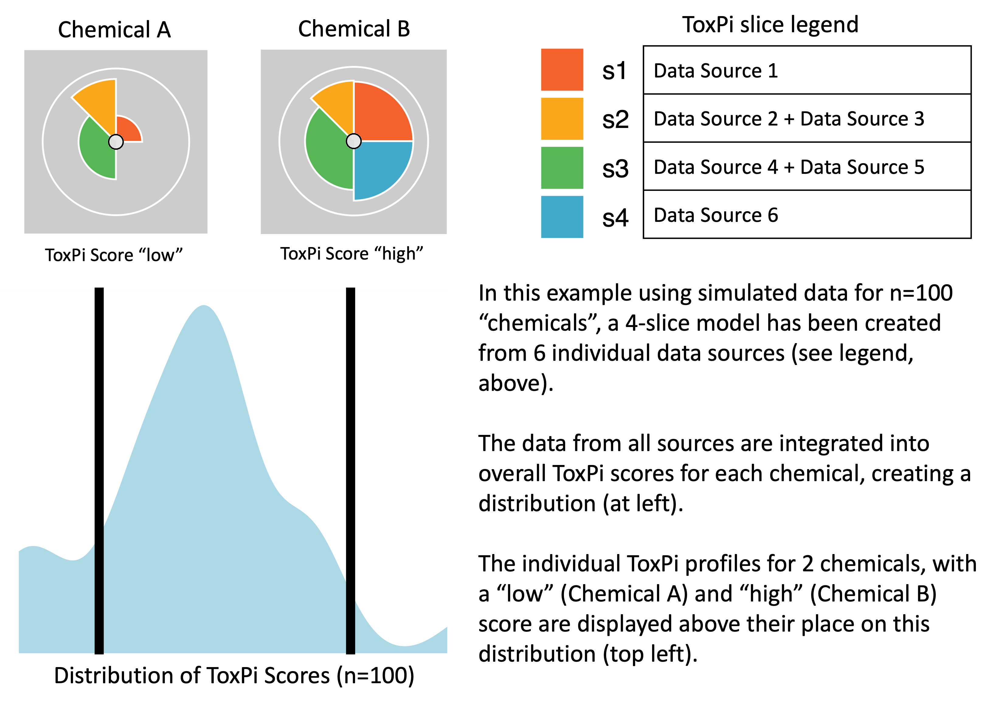
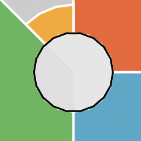

```{r setup, include=FALSE}
knitr::opts_chunk$set(echo = TRUE, collapse = TRUE, fig.retina = 2)
```

```{css, echo=FALSE}

h1.title {
  font-size: 28px;
}
h1 { /* Header 1 */
  font-size: 20px;
}
h2 { /* Header 2 */
    font-size: 20px;
}
h3 { /* Header 3 */
  font-size: 18px;
}
h4 { /* Header 4 */
  font-size: 16px;
   color: DarkBlue;
}
code.r{ /* Code block */
    font-size: 12px;
}
.center-figs > p {
  display: flex;
  justify-content: center;
}
```

## Introduction

This document introduces ToxPi and describes how to use the `toxpiR` package to easily import, recombine, analyze, and visualize high dimensional data. The `toxpiR` package is an R implementation of ToxPi that offers new features over what was previously available for data handling, recombination, and customization; provides formally packaged, open-source code for ToxPi; extends the application domain by supporting rapid analysis of massive datasets; and bridges with the stand-alone, [Graphical User Interface (GUI)](https://toxpi.org) Java application and [ArcGIS Toolkit](https://github.com/ToxPi/ToxPi-GIS). 

## What is ToxPi?

The Toxicological Prioritization Index (ToxPi) is a statistical modeling framework that allows transparent integration and visualization of data across disparate sources (i.e. multimodal or multiscale information). This framework aggregates related features into scored ‘slices’, rescales individual slice scores to range 0–1, and then develops an overall score for each sample using a weighted model. The slice weights can be interpreted as the "importance" of categorized features when predicting sample scores and associated ranks. The resulting scores for each sample are visualized as ToxPi profiles (see image below). Slice weights are represented as the angle of the slice, slice scores are represented as the radius, and the overall sample scores are represented by the combination of slice angles and radii (arc-length). These visualizations allow for quick comparison of overall feature importance, feature impacts driving a specific sample, relative impact ranking of common features between samples, and overall ranking between samples. As a flexible method capable of integrating data from any source, it has been applied to problems in several different fields. Additional information is linked from [toxpi.org](https://toxpi.org).   

<div class="center-figs">
{width=700px}

</div>

## Outline

There are three main steps in using this package: 

- **Loading data**: Calculating scores requires a data frame in which the data is formatted where column names are the feature/metric names and raw sample data are rows. An id column with unique features names is also suggested to be included in the data frame. Users often obtain this data frame by reading in a csv file with read.csv(file, header = TRUE). Alternatively, if a user has exported a data model to a csv from either toxpiR or the ToxPi Java GUI, both the data and model can be read in from the file using txpImportCSV(file), which returns a list where the data is contained under input. This is highly recommended if the data is planned to be shared with the model for recreation. For more info about importing csv data models, see [Import ToxPi CSV files](https://cran.r-project.org/package=toxpiR/vignettes/importFromCSV.html).

- **Creating ToxPi Model**: ToxPi models can be created by first building TxpSlice objects, which are fed into TxpModel() to create a TxpModel object. Each slice can be made up of one or more, optionally transformed, features from the input data and can contain lower and upper bound feature data as well. When creating TxpModel objects, you should also name the slices, provide their weights, optionally provide any slice transformations, and specify how the model should handle negative data and rank ties. Alternatively, if a user has exported a data model to a csv either from toxpiR using txpExportCSV() or from the ToxPi Java GUI, both the data and model can be read in using txpImportCSV(), which returns a list where the model is contained under model. For more info about exporting csv data models, see [Export ToxPi CSV files](https://cran.r-project.org/package=toxpiR/vignettes/exportToCSV.html).

- **Computing ToxPi Scores**: Sample scores can be computed per slice as well as overall using txpCalculateScores(). The S4 object resulting from this step will combine and store the ToxPi model and scores all in one place. This final object will contain all the information needed for plotting. 

Information contained within different slots of the S4 objects created using this package can be obtained using *accessor functions*. More details on how this can be done is present later in the document. 


## Installation

### **Standard installation**

You can install `toxpiR` from [CRAN](https://cran.r-project.org/web/packages/available_packages_by_name.html). Some dependencies located on [Bioconductor](https://www.bioconductor.org/packages/release/BiocViews.html#___Software) must be installed separately from toxpiR as well.

```{r, eval = FALSE}
# Manually install bioconductor packages if not already installed
if (!requireNamespace("BiocManager", quietly = TRUE)) {
  install.packages("BiocManager")
}
if (!requireNamespace("S4Vectors", quietly = TRUE)) {
  BiocManager::install("S4Vectors")
}
if (!requireNamespace("BiocGenerics", quietly = TRUE)) {
  BiocManager::install("BiocGenerics")
}

# Install toxpiR
install.packages("toxpiR")
```

### **Installation from GitHub**

Any new features will be first added to the GitHub version of the package. However, it may be less stable than the release on CRAN. Before attempting a direct installation from GitHub, please make sure you have `remotes` package installed. 
Note, Windows users may need Rtools to install packages directly from GitHub. 
 
```{r, eval = FALSE}
# Manually install bioconductor packages if not already installed
if (!requireNamespace("BiocManager", quietly = TRUE)) {
  install.packages("BiocManager")
}
if (!requireNamespace("S4Vectors", quietly = TRUE)) {
  BiocManager::install("S4Vectors")
}
if (!requireNamespace("BiocGenerics", quietly = TRUE)) {
  BiocManager::install("BiocGenerics")
}

# Install remotes package if not already installed
if (!requireNamespace("remotes", quietly = TRUE)) {
  install.packages("remotes")
}

# Install toxpiR from github
remotes::install_github("ToxPi/toxpiR")
```

## **Launching package in R**

```{r load, warning=FALSE}
library(toxpiR)
```


## Flowchart 
<div class="center-figs">
{height=100% width=100%}
</div>

This flowchart details the basic steps necessary to analyze data using `toxpiR`. A separate vignette describes how to load and work with the CSV data file using txpImportCSV() function. Usage for all other functions is described below using an example data set. To view a list of all functions available in this package, please run:  

```{r, eval = FALSE}
lsf.str("package:toxpiR")
```  

## Example usage

Data must be entered as a data frame where column names are features. This is usually obtained from read.csv() if a model has not been previously created, or txpImportCSV() if the csv file has header lines specifying model information. If you are using the GUI header format, or would like more information about toxpiR csv files, please refer to the [Export ToxPi CSV files](https://cran.r-project.org/package=toxpiR/vignettes/exportToCSV.html) vignette. 

The standard data input is a standard R dataframe with rows as your datapoints and columns as features that may be turned into ToxPi slices. Two simple example data sets called *txp_example_input* and *txp_example_input_CI* are available within the package. We will use the CI (confidence interval) toy data to walk through a simple analysis and explain the functions available in this package. These metrics that we have specified can be in completely different scales and data type, but first we will show a simple example of the package usage.


### Load the dataset

```{r}
data(txp_example_input_CI, package = "toxpiR")
head(txp_example_input_CI)
```

### Specify slice information 

The first step is to specify information about each slice before creating a Toxpi model. This can be done using the **TxpSliceList()** and **TxpSlice()** functions. These slices can be made up of one or more features from the input dataset and are specified by listing the features that go into each slice in the **TxpSlice()** function. We can also specify how we want to transform the features with the  **TxpTransFuncList()** function. This means we can do a different transformation per feature instead of having to transform the entire input dataset within a slice. Upper and lower bounds for features can also be provided with the slice. Features must not intersect between the slices best estimate, its lower bound, and its upper bound, and at least one of the three levels must be provided. More information about bounds is provided directly below and in the Calculate ToxPi Scores section. 

#### toxpiR Slice Bounds

The toxpiR package allows for users to provide metrics to be included in lower and upper bounds for slices via *txpValueNamesLower* and *txpValueNamesUpper*. These bounds follow the same methodology as the original framework, which is considered the best estimate and is still provided via *txpValueNames*. At least one of the lower bound, best estimate, and upper bound must be provided in a slice. Transformation functions can also be provided to the bounds via the *txpTransFuncLower* and *txpTransFuncUpper* slots. 

#### TxpSlice(txpValueNames, txpTransFuncs, txpValueNamesLower, txpTransFuncsLower, txpValueNamesUpper, txpTransFuncsUpper)

>Store individual slice objects. 

**Arguments**

> *txpValueNames* : character vector indicating which data to include in the slice. Can just be the name of a single column if that is all the slice contains.

> *txpTransFuncs* : List of transformation functions to use with one function per entry in txpValueNames. Can be created using TxpTransFuncList() method. Defaults to NULL. 

> *txpValueNamesLower* : character vector indicating which data to include in the lower CI of the slice. Can just be the name of a single column if that is all the slice contains.

> *txpTransFuncsLower* : List of transformation functions to use with one function per entry in txpValueNamesLower. Can be created using TxpTransFuncList() method. Defaults to NULL. 

> *txpValueNamesUpper* : character vector indicating which data to include in the upper CI of the slice. Can just be the name of a single column if that is all the slice contains.

> *txpTransFuncsUpper* : List of transformation functions to use with one function per entry in txpValueNamesUpper. Can be created using TxpTransFuncList() method. Defaults to NULL. 

#### TxpSliceList()

>Method to merge all individuals slices together and assign slice names.

**Basic Usage**

```{r}

## Goal - Create three slices with transformations and increasing complexity
# Slice 1 (No bounds): Slice1_M1 (no transformation)
# Slice 2 (No bounds): Slice2_M1 (square) 
# Slice 3: Slice3_M1 and Slice3_M2 (no transformation)
# Slice 3 Lower CI: Slice3_L1 and Slice3_L2 (no transformation)
# Slice 3 Upper CI: Slice3_U1 (square) and Slice3_U2 (no transformation)

slice2.trans <- TxpTransFuncList(func1 = function(x) x^2)
slice3.upper.trans <- TxpTransFuncList(func1 = function(x) x^2, func2 = NULL)

f.slices <- TxpSliceList(Slice1 = TxpSlice(txpValueNames = "Slice1_M1"), 
                         Slice2 = TxpSlice(txpValueNames = "Slice2_M1", 
                                           txpTransFuncs = slice2.trans),
                         Slice3 = TxpSlice(txpValueNames = c("Slice3_M1", 
                                                             "Slice3_M2"),
                                           txpValueNamesLower = c("Slice3_L1", 
                                                                  "Slice3_L2"),
                                           txpValueNamesUpper = c("Slice3_U1", 
                                                                  "Slice3_U2"),
                                           txpTransFuncsUpper = 
                                             slice3.upper.trans))

```

### Create ToxPi model

The ToxPi model object is core for specifying how the created slices should behave when the scores are calculated. In this step, we need to specify what the slices we created above are and assign those slices weights. We can also assign slice transformation functions to overall slices after feature aggregation. The specified slice transformation will apply to each of the lower bound, best estimate, and upper bound if provided.
The model should also specify how both negative data and rank ties should be handled. The model is essential to the analysis because it is going to specify how our calculations are performed and allow for recreation of results. 

#### TxpModel()

**Arguments**

> *txpSlices* : TxpSliceList() object.

> *txpWeights* : numeric vector specifying weight of each slice in the same order as txpSlices. By default, all slices are weighted equally (1).

> *txpTransFuncs* : TxpTransFuncList object. Defaults to NULL, if a list is provided, its length must be equal to the number of slices present.

> *rankTies* : character string specifying how ties are treated. Available options "average", "first", "last", "random", "max" and "min". Pased to base::rank function.

> *negativeHandling* : character string specifying how negative values are treated. Available options are "keep" and "missing". Defaults to keep. 

> adjusted : Scalar logical to adjust returned weights such that they sum to 1. 


**Usage**

```{r}

## Goal - Create ToxPi model.
# Slice 1, weight = 2, no transformation
# Slice 2, weight = 1, apply log transform to final value. 
# Slice 3, weight = 1, no transformation

# Object storing list of transformation functions.
final.trans <- TxpTransFuncList(f1 = NULL, f2 = function(x) log10(x), f3 = NULL) 

f.model <- TxpModel(txpSlices = f.slices, 
                    txpWeights = c(2,1,1),
                    txpTransFuncs = final.trans,
                    rankTies = "average",
                    negativeHandling = "keep")

```

### Export toxpiR data model (recommended)

The txpModel object can be exported along with the data that it is intended to be used on in a specially formatted csv file using *txpExportCSV()*. This is an important step, as it allows easy recreation of both models and results. Here we will provide a quick overview on how to export data models for later use with the toxpiR package, but models can also be exported for use with the Java GUI if they are compatible. For more info about exporting csv data models, see [Export ToxPi CSV files](https://cran.r-project.org/package=toxpiR/vignettes/exportToCSV.html).

#### txpExportCSV()

**Arguments**

> *model* : ToxPi model object created using TxpModel() function.

> *input* : dataframe containing input data for ToxPi model. 

> *id.var* : Character scalar or integer, column name or index in 'input' that stores unique sample id. Deafults to NULL.

> *fills* : Vector containing slice colors as either hex codes or R recognized colors. Defaults to a color scheme matching the ToxPi GUI.

> *format* : text string specifying whether to format the file for toxpiR or the Java GUI. Options are "toxpiR" and "gui". Default is "toxpiR".

> *fileName* : text string to name the output csv file. Default is "txpModel.csv".

```{r, eval=FALSE}
# Export the data model
txpExportCSV(fileName = "txp_vignette_model.csv", 
             model = f.model, 
             input = txp_example_input_CI)
```

### Calculate ToxPi scores

Calculate ToxPi Scores for the given ToxPi model and input data. This input data is what we loaded in previously as a data frame, which can be obtained in several ways including *read.csv()* on a basic csv or the input obtained from a compatible data model csv and *txpImportCSV()*. This step uses the model we have created or read in to specify how the ToxPi scores should be calculated. The results object that is created also stores the model used, allowing for easy reference when you are dealing with many models and results. 

#### Calculations
The original ToxPi framework calculates slice scores by performing specified metric transformations, summing all (best estimate) metrics within a slice to get unscaled slice scores, optionally performing specified slice transformations (toxpiR only), and then rescaling each slice across samples so that it's score ranges from 0-1 across the dataset. After this step, any (best estimate) missing data is treated as 0. After this, slice weights are rescaled so that they sum to 1, and overall scores are calculated for samples as a linear combination of slice weights and slice scores, resulting in overall ToxPi scores for samples ranging 0-1. 

The toxpiR package also provides the option for users to provide metrics as lower and upper bounds for slices. Because of this, the original ToxPi framework for calculations has been slightly updated for toxpiR in a manner that can replicate old results while also allowing for more complex models and calculations. Firstly, when the new method sums metrics for aggregating slices, each of the lower bound, best estimate, and upper bound are summed independently and create three separate slice scores. Furthermore, during this step, any missing data in the upper bound is treated as the maximum metric value across samples prior to summation to ensure deflation of the upper bound doesn't occur. The new ToxPi framework also adds a step after slice transformations in which the transformed slice scores are divided by the number of metrics defined in the previous summation. This step does not effect the 0-1 scaled slice scores in the original framework, while also ensuring that slices with differing number of metrics between their bounds and best estimate aren't accidentally inflated or deflated when comparing bounds and the best estimate. When rescaling slice scores 0-1, the rescaling occurs across all of the lower bound, best estimate, and upper bound together, ensuring that scores across bound levels remain proportional. Finally, when calculating the overall ToxPi scores, the lower bound, best estimate, and upper bound each independently calculate an overall score if they are provided for at least one slice. If any of the three don't appear in any of the slices, that level won't be calculated and is not a part of the analysis. If any of the three appear in some slices but not others, the slices lacking the level will treat it as missing data, with the lower bound mapping missing slice scores to 0, the best estimate mapping missing slice scores to the lower bound score (or 0 if lower bound is unprovided), and the upper bound mapping missing slice scores to 1. Thus the calculation steps are as follows:

1. If metric transformations exist for a slice, transform metrics for that slice by their specified transformations
2. If upper bound metrics exist, replace missing or infinite data with the maximum value for that metric in the dataset
3. Sum the specified metrics within a slice independently for provided lower bound, best estimate, or upper bound metrics to create up to 3 slice scores
4. If slice transformations are provided, transform all slice scores within a slice by the slice transformation
5. Divide each slice score by the number of metrics used in its summation in step 3 (ie the average after transforming the sum)
6. Rescale all slice scores within a slice 0-1 together, such that the lower bound, best estimate, and upper bound slice scores remain proportional with the highest score across any of the 3 provided mapping to one and the lowest score mapping to 0.
7. Calculate overall ToxPi scores as a linear combination of slice weight and slice score for each of the 3 bound levels that appear somewhere in the model, remapping any missing data to 0 for the lower bound, to the lower bound (0 if the lower bound is unprovided) for the best estimate, and to 1 for the upper bound. If any of these levels don't exist anywhere in the model, they will not be a part of the analysis, will not have been used in any of the previous steps, and will not have slice scores nor an overall score.

#### txpCalculateScores()

**Arguments**

> *model* : ToxPi model object created using TxpModel() function.

> *input* : dataframe containing input data for ToxPi model. 

> *id.var* : Character scalar or integer, column name or index in 'input' that stores unique sample id. Deafults to NULL.

> *rank.ties.method* : deprecated, and now should be provided in the TxpModel object. Providing here will overwrite the TxpModel slots for now, but please alter code to follow the new format.

> *negative.value.handling* : deprecated, and now should be provided in the TxpModel object. Providing here will overwrite the TxpModel slots for now, but please alter code to follow the new format.

**Usage**


```{r}
#Load a more complex model than we created previously
f.model <- txp_example_model_CI 

#Calculate results, integer 1 is provided for id.var specifying the first column
#is the id column in the input
f.results <- txpCalculateScores(model = f.model,
                                input = txp_example_input_CI,
                                id.var = 1) 

txpSliceScores(f.results) #ToxPi slice scores
txpScores(f.results) #Overall ToxPi scores
txpSliceScoresLower(f.results) #ToxPi lower CI slice scores
txpSliceScoresUpper(f.results) #ToxPi upper CI slice scores
txpWeights(f.results) #Print weights
txpMissing(f.results) #Proportion of missing data within each slice
```

### Visualization

Two paths exist for visualization, **ggplot** methods and **grid** methods. The ggplot method uses the `ggplot2` package and allows for highly customizable profiles allowing for several visualization experiences, as well as the ability to visualize lower and upper slice bounds. The grid method uses advanced `grid` graphics and can be implemented using pieGrob objects that are compatible with the grid system. Additional plots can be made such as a rank plot by using the data stored in the results object. The results object also allows for the flexibility to use other R plotting packages if preferred. 

<br>
**Summary**: The ggPlot graphics path will be the best option for users wanting to create ToxPi profiles, with many options for customization. The grid graphics path is for users wanting to modify very specific, basic elements of ToxPi profiles and/or recombine profiles with other graphics. The `ggplot2` package (high-level) is built atop `grid` graphics (low-level), so the two systems interact well.

:::: {style="display: flex; justify-content:space-around;"}

<div >
<h3>ggPlot</h3>
* Examples shown in this vignette produce a "look-and-feel" that is closer to the graphics output of the familiar [ToxPi GUI](https://toxpi.org)
* Aesthetics are easy to customize 
* Includes missing data visuals (center circle à la ToxPi GUI output)
* Includes ability to visualize lower and upper slice bounds
</div>

<div >
<h3>grid</h3>
* Formal, S4-based customization options for visuals using the R `grid` package and the "grob" (grid graphical object) framework
* ToxPi profile graphics created as grobs can be directly inserted into more complex figures as points on a scatterplot, leaves on a cluster dengrogram, overlaid on a map, etc.
* Vignette examples show how to highlight individual profiles and highlight individual slices 
</div>

::::

#### ggplot Method

This method uses the `ggplot2` package to draw highly customizable ToxPi profiles with multiple different aesthetics and information options. The most notable aesthetic addition is the inclusion of information regarding the amount of missing data each slice has, which is represented by the a small circle of interior slices as is shown in profiles generated by the ToxPi GUI. Each interior slice is colored on a grey scale, with black representing all missing data and white representing no missing data. Each new customization option, along with some other notable differences, are described below. Note: Setting any of parameters that take text colors to NULL will cause that parameter not to be plotted.

<br>
**Customization Options (Arguments)**

> *fills* : Vector containing slice colors as either hex codes or R recognized colors. Defaults to a color scheme matching the ToxPi GUI.

> *showMissing* : Boolean to show missing data information. Defaults to TRUE. 

> *showCenter* : Boolean to show inner circle. Defaults to TRUE. FALSE overrides showMissing.

> *showScore* : Boolean to show overall profile scores. Defaults to TRUE.

> *ncol* : Integer specifying number of columns in plot. Default is an automatic calculation by ggplot. 

> *bgColor* : Text specifying background color for profiles as either a hex code or R recognized color. Defaults to "gray80".

> *borderColor* : Text specifying color of max radius ring as either a hex code or R recognized color. Defaults to "white".  

> *sliceBorderColor* : Text specifying color of slice borders as either a hex code or R recognized color. Defaults to "white".  

> *sliceLineColor* : Text specifying color of slice guidelines as either a hex code or R recognized color. Defaults to "white". 

> *sliceValueColor* : Text specifying color of slice scores as either a hex code or R recognized color. Defaults to NULL. Only capable of showing scores for the main slice, not CI scores.   

> *sliceBoundColor* : Text specifying color of slice scores as either a hex codes or R recognized color. Defaults to "black". When a main level is not provided anyhwere in the model or showMain is set to FALSE, bounds are automatically colored based on fills.

> *showMain* : Boolean to plot main slices, which are represented as color filled areas. Defaults to TRUE.

> *showLower* : Boolean to plot lower slice bounds, which are represented as dotted lines. Defaults to TRUE.

> *showUpper* : Boolean to plot upper slice bounds, which are represented as dashed lines. Defaults to TRUE.

<br>
**Usage**

Depending on export method, plot resolution may end up poor. SVG and PDF images tend to produce better results than PNG. Usage and example plot output are shown below.

<div class="center-figs">
```{r, fig.show='hold', fig.width=4, fig.height=4}
#If you skipped the model building tutorial section
f.results <- txp_example_results_CI

# Default plot
plot(f.results, package = "gg") # Using ggplot package
```
</div>

Sometimes the inner circle of the ToxPi figure can show plotting artifacts. A possible workaround for this is to create a wrapper function around `ggplot2:::coord_munch` as shown below. The ggplot package is working on fixing this and will push their own patch in a new update.

```{r, fig.show = "hide"}
## Optional code to make smoother lines

# Plot before updating coord_munch
plot(f.results["1"], package = "gg") 

# Save the original version of coord_munch
coord_munch_orig <- ggplot2:::coord_munch

# Make a wrapper function that has a different default for segment_length
if (length(formals(coord_munch_orig)) == 5) {
  coord_munch_new <- function(coord, data, range, segment_length = 1/1000,
                              is_closed = FALSE) {
    coord_munch_orig(coord, data, range, segment_length, is_closed)
  }
} else {
  coord_munch_new <- function(coord, data, range, segment_length = 1/1000) {
    coord_munch_orig(coord, data, range, segment_length)
  }
}

# The environment may need to be set
#environment(coord_munch_new) <- environment(coord_munch_orig)

# Replace ggplot2:::coord_munch with coord_munch_new
assignInNamespace("coord_munch", coord_munch_new, ns = "ggplot2")

# Plot after updating coord_munch
plot(f.results["1"], package = "gg") 

# Revert to original coord_munch ater plotting if desired 
assignInNamespace("coord_munch", coord_munch_orig, ns = "ggplot2")
```

<div class="center-figs">


</div>

<br>
**Customization examples**

#### Coloration Options

<div class="center-figs">
```{r, fig.show="hold"}
# Changing the slice colors
colors <- c("orange", "green", "magenta", "lightblue")
plot(f.results["2"], package = "gg", fills = colors)
plot(f.results["2"], package = "gg", fills = NULL)
```
</div>

<div class="center-figs">
```{r, fig.show="hold"}
# Changing the background color
plot(f.results["2"], package = "gg", bgColor = "lightskyblue")
plot(f.results["2"], package = "gg", bgColor = NULL)
```
</div>

<div class="center-figs">
```{r, fig.show="hold"}
# Changing the max radius ring color
plot(f.results["2"], package = "gg", borderColor = "black")
plot(f.results["2"], package = "gg", borderColor = NULL)
```
</div>

<div class="center-figs">
```{r, fig.show="hold"}
# Changing the slice border color
plot(f.results["2"], package = "gg", sliceBorderColor = "magenta")
plot(f.results["2"], package = "gg", sliceBorderColor = NULL)
```
</div>

<div class="center-figs">
```{r, fig.show="hold"}
# Adding slice guidelines 
plot(f.results["2"], package = "gg", sliceLineColor = "red")
plot(f.results["2"], package = "gg", sliceLineColor = NULL) 
```
</div>

<div class="center-figs">
```{r, fig.show="hold"}
# Adding visible slice scores
plot(f.results["2"], package = "gg", sliceValueColor = "brown")
plot(f.results["2"], package = "gg", sliceValueColor = NULL)
```
</div>

#### Binary Options
<div class="center-figs">
```{r, fig.show="hold"}
# Hiding inner circle
plot(f.results["2"], package = "gg", showCenter = TRUE)
plot(f.results["2"], package = "gg", showCenter = FALSE)
```
</div>

<div class="center-figs">
```{r, fig.show="hold"}
# Hiding missing data information (pure white inner circle)
plot(f.results["2"], package = "gg", showMissing = TRUE)
plot(f.results["2"], package = "gg", showMissing = FALSE)
```
</div>

<div class="center-figs">
```{r, fig.show="hold"}
# Hiding the overall profile scores
plot(f.results["2"], package = "gg", showScore = TRUE)
plot(f.results["2"], package = "gg", showScore = FALSE) 
```
</div> 

<div class="center-figs">
```{r, fig.show="hold"}
#Hiding the lower and upper bounds
plot(f.results["2"], package = "gg", showLower = FALSE, showUpper = FALSE) 

# Hiding the main slice
plot(f.results["2"], package = "gg", showMain = FALSE)
```
</div>

<div class="center-figs">
```{r, fig.show="hold"}
# Coloring the bounds
plot(f.results["2"], package = "gg", sliceBoundColor = "black")
plot(f.results["2"], package = "gg", sliceBoundColor = NULL) 
```
</div>

#### Format/Theme Options

```{r, fig.width = 7, fig.align='center'}
# Specifying the number of columns in the plot
plot(f.results, package = "gg", ncol = 5) 
```

<div class="center-figs">
```{r, fig.show="hold", fig.height=5}
# Moving the legend using ggplot built in theme functions
plot(f.results, package = "gg", ncol = 5) + ggplot2::theme(legend.position = "bottom") 
plot(f.results, package = "gg", ncol = 2) + ggplot2::theme(legend.position = "left")
```
</div>

```{r, fig.align='center'}
# Removing plot margins
plot(f.results, package = "gg") + ggplot2::theme(plot.margin = ggplot2::margin(0, 0, 0, 0, "cm"))
# Removing spacing between panels
plot(f.results, package = "gg") + ggplot2::theme(panel.spacing = ggplot2::unit(0, "lines"))
# Removing text labels
plot(f.results, package = "gg") + ggplot2::theme(strip.text.x = ggplot2::element_blank())
# A combination of the above for a rank ordered plot
plot(f.results[order(txpRanks(f.results)[1:9])], package = "gg") +
  ggplot2::theme(
    plot.margin = ggplot2::margin(0, 0, 0, 0, "cm"),
    panel.spacing = ggplot2::unit(0, "lines"),
    strip.text.x = ggplot2::element_blank(),
    legend.position = "none"
  )
```

**Missing Data Examples**
```{r, fig.align='center'}
## Creating an example with more variable missing data amounts
f.input <- txp_example_input_CI

# Add more missing data to slice 2 via metrics named Slice2_M1 and Slice2_M2 in 
# the raw data
f.input[2:8, "Slice2_M1"] <- NA
f.input[3:10, "Slice2_M2"] <- NA

# Modify metric transformation functions for slice 3
fun1 <- \(x) sqrt(x - 1.5)
fun2 <- \(x) x
txpTransFuncs(txpSlices(f.model)[[3]]) <- TxpTransFuncList(f1 = fun1, f2 = fun2)

# Calculate new ToxPi results
f.results_missing <- txpCalculateScores(f.model, f.input, id.var = 1)

# View missing data proportions
txpMissing(f.results_missing)

# View new result profile
plot(f.results_missing["2"], package = "gg")
```


#### pieGrob Method
This method is the default and uses the grid package with grob objects to draw ToxPi profiles that can be individually customized after plotting. This method does not allow for the wide array of aesthetics as ggplot does, but instead it allows the user to highlight specific profiles or slices that have significant importance in their results. Methods for highlighting information after plotting is shown below.
```{r fig.width=7, fig.height=3}
library(grid) # Load library
plot(f.results) # ToxPi visuals
# grid.ls() #List grid info

# Highlight one figure using its label
grid.edit("pie-1", fills = c("red", "blue", "black", "brown"))

# Or just one slice in a figure
grid.edit("pie-10::slice3", gp = gpar(fill = "#FC0FC0"))
```

#### ggplot vs grid Comparison

<div class="center-figs">
```{r, fig.show="hold"}
#Single sample
plot(f.results["2"])
plot(f.results["2"], package = "gg") 
```
</div>

<div class="center-figs">
```{r, fig.show="hold"}
# Subset plots, Profiles ranked 1-4
plot(f.results[order(txpRanks(f.results))[1:4]]) 
plot(f.results[order(txpRanks(f.results))[1:4]], package = "gg") 
```
</div>

<div class="center-figs">
```{r, fig.show="hold"}
## Long sample names for cramped plots

#change the first sample name in f.results
txpIDs(f.results)[1] <- "I am a long sample name"

plot(f.results) #grid plot for all samples
plot(f.results, package = "gg") #ggplot for all samples

txpIDs(f.results)[1] <- "1" # Change the sample name back
```
</div>

<div class="center-figs">
```{r, fig.show="hold"}
## Long slice names for cramped plots

#change first slice name. Note: changing models/results is not recommended for 
#actual results objects. Please create a new model with real data
names(f.results@txpModel)[1] <- "long slice name"
colnames(f.results@txpSliceScores)[1] <- "long slice name"
colnames(f.results@txpSliceScoresLower)[1] <- "long slice name_lower"
colnames(f.results@txpSliceScoresUpper)[1] <- "long slice name_upper"

#plot results using grid
plot(f.results)
#plot results using ggplot
plot(f.results, package = "gg") + ggplot2::theme(
  legend.position = "bottom",
  legend.title = ggplot2::element_text(size = 10),
  legend.text = ggplot2::element_text(size = 6)
)

#change slice name back
names(f.results@txpModel)[1] <- "ExampleA"
colnames(f.results@txpSliceScores)[1] <- "ExampleA"
colnames(f.results@txpSliceScoresLower)[1] <- "ExampleA_lower"
colnames(f.results@txpSliceScoresUpper)[1] <- "ExampleA_upper"

```
</div>

#### Statistic Plots
```{r fig.width=5, fig.height=4, fig.align='center'}
# Rank plot
plot(f.results, y = txpRanks(f.results), labels = 1:10)
plot(f.results, y = txpRanksLower(f.results), labels = 1:10)
plot(f.results, y = txpRanksUpper(f.results), labels = 1:10)
```
```{r fig.width=5, fig.height=4, fig.align='center'}
# Hierarchical Clustering
f.hc <- hclust(dist(txpSliceScores(f.results)))
f.hc.low <- hclust(dist(txpSliceScoresLower(f.results)))
f.hc.up <- hclust(dist(txpSliceScoresUpper(f.results)))

plot(f.hc, hang = -1, labels = txpIDs(f.results), xlab = '', sub = '')
plot(f.hc.low, hang = -1, labels = txpIDs(f.results), xlab = '', sub = '')
plot(f.hc.up, hang = -1, labels = txpIDs(f.results), xlab = '', sub = '')
```

## Citation

To cite `toxpiR` in your work, please use: 
https://cran.r-project.org/package=toxpiR (Manuscript currently in review)
