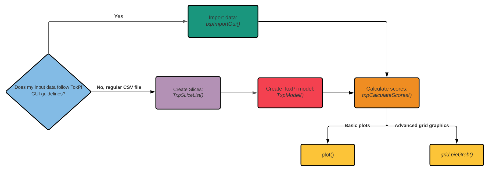

<style type="text/css">

h1.title {
  font-size: 28px;
}
h1 { /* Header 1 */
  font-size: 20px;
}
h2 { /* Header 2 */
    font-size: 20px;
}
h3 { /* Header 3 */
  font-size: 18px;
}
h4 { /* Header 4 */
  font-size: 16px;
   color: DarkBlue;
}
code.r{ /* Code block */
    font-size: 12px;
}
</style>


```{r setup, include = FALSE}
knitr::opts_chunk$set(
  collapse = TRUE,
  comment = "#>"
)
```

## Introduction

This document describes how to use the toxpiR package to easily import, recombine, and analyze high dimensional data. Users can also plot subsets of data using built-in plotting functions for visualizing and highlighting ToxPi results. 

## What is toxpiR?

Toxicological Priority Index (ToxPi) is a decision support tool that allows transparent integration and visualization of data across disparate information domains to aid in prioritization.

toxpiR is a system for transforming data into visual profiles by calculating toxpi scores in R. You provide the data, tell toxpiR how to integrate information, which transformation functions to use, and it takes care of the details. toxpiR was designed to enable exploration of data with flexible input formats, is compatible with input/output from the ToxPi GUI and behaves nearly identically to the GUI.

## Outline

There are three main steps in using this package: 

- **Loading data**: Users can load comma-separated value (csv) formatted data where slices are stored as columns and attributes are rows. The package also has a function to load data that is formatted in any one of the GUI layouts where slice information is presented in rows beginning with a hash tag(#).   

- **Creating ToxPi Model**: ToxPi model can be created by specifying information about each slice and its corresponding weights. 

- **Computing ToxPi Scores**: Scores can be computed per attribute as well as for each slice. The S4 object resulting from this step will combine and store the ToxPi model and scores all in one place. This final object will contain all the information needed for plotting. 

Data contained within different slots of the S4 objects created using this package can be obtained using *accessor functions*. More details on how this can be done is present later in the document. 


## Installation

### **Standard installation**

You can install toxpiR from [CRAN](https://cran.r-project.org/web/packages/available_packages_by_name.html) with:

```{r, eval = FALSE}
install.packages("toxpiR")
```

### **Installation from GitHub**

Before attempting a direct installation from GitHub, please make sure you have `devtools` package on your system. 
Note, Windows users will need Rtools to install directly from GitHub. 
 
```{r, eval = FALSE}
remotes::install_github("ToxPi/toxpiR")
```

## **Launching package in R**

```{r packages, warning=FALSE}
library(toxpiR)
```


## Flowchart 
<center>
{width=700px}
</center>

This flowchart details the basic steps necessary to analyze data using toxpiR. A separate vignette describes how load and work with the GUI data file using txpImportGui() function. Usage for all other functions is described below using an example data set. To view a list of all functions available in this package, please run:  
  
> lsf.str("package:toxpiR")   

## Example usage

Data can either be entered as a regular csv file without the header lines specifying slice information, or in one of the GUI input formats. An example data set following the GUI input guidelines may look like:

<center>
{width=700px}

</center>


In the GUI data format, each row beginning with a hash tag (#) specifies a slice. For each slice, the first column will contain a string beginning with the hash tag followed by the slice name, weight, color and scaling, all separated by exclamation points (!).  Any column with a non-empty string will indicate that the corresponding metric is included in that slice, e.g. Slice A contains metric1 while Slice C contains metric1 and metric4 in the example above.

A flat file will simply begin from row 6, without lines specifying slice information. A simple example data set called *txp_example_input* is available within the package. We will use this 10 x 8 toy data to walk through the different functions available in this package. 


### Load the dataset

```{r }
data(txp_example_input, package = "toxpiR")
head(txp_example_input)
```

### Specify slice information 

The first step is to specify information about each slice before creating a Toxpi model. This can be done using the **TxpSliceList()** and **TxpSlice()** functions.


#### TxpSlice(txpValueNames, txpTransFuncs)

>Store individual slice objects. 

**Arguments**

> *txpValueNames* : character vector indicating which data to include in the slice. Can just be the name of a single column if that is all the slice contains.

> *txpTransFuncs* : List of transformation functions to use with one function per entry in txpValueNames. Can be created using TxpTransFuncList() method. Defaults to NULL. 

#### TxpSliceList()

>Method to merge all individuals slices together and assign slice names.

**Basic Usage**


```{r }

## Goal - Create two slices with transformation functions 
# Slice 1: Metric 1, No transformation 
# Slice 2: Metric 2 (square) and Metric 3 (no transformation)

slice2.trans <- TxpTransFuncList(func1 = function(x) x^2, func2 = NULL)

f.slices <- TxpSliceList(Slice1 = TxpSlice("metric1"), 
                         Slice2 = TxpSlice(c("metric2", "metric3"), 
                                           txpTransFuncs = slice2.trans ))

```

### Create ToxPi model

Method to store ToxPi model objects. This object is needed in order to calculate ToxPi scores. Transformation functions can be specified at the input data level (shown above), or at the model level (for example 0 t0 1 transformation of final slice value).

#### TxpModel()

**Arguments**

> *txpSlices* : TxpSliceList() object.

> *txpWeights* : numeric vector specifying weight of each slice. By default, all slices are weighted equally (1). 

> *txpTransFuncs* : TxpTransFuncList object. Defaults to NULL, if a list is provided, its length must be equal to the number of slices present.

> adjusted : Scalar logical to adjust returned weights such that they sum to 1. 


**Usage**

```{r }

## Goal - Create ToxPi model.
# Slice 1, weight = 2
# Slice 2, weight = 1, apply log transform to final value. 

# Object storing list of transformation functions.
final.trans <- TxpTransFuncList(f1 = NULL, f2 = function(x) log10(x)) 

f.model <- TxpModel(txpSlices = f.slices, 
                    txpWeights = c(2,1),
                    txpTransFuncs = final.trans)

```

### Calculate ToxPi scores

Calculate ToxPi Scores for the given ToxPi model and input data

#### txpCalculateScores()

**Arguments**

> *model* : ToxPi model object created using TxpModel() function.

> *input* : dataframe containing input data for ToxPi model. 

> *id.var* : Character scalar, column in 'input' to store in. Deafults to NULL.

> *rank.ties.method* : character string specifying how ties are treated. Available options "average", "first", "last", "random", "max" and "min". Pased to base::rank function.

**Usage**

```{r }
f.results <- txpCalculateScores(model = f.model, 
                                input = txp_example_input,
                                id.var = 'name' ) 

txpSliceScores(f.results) #ToxPi scores
txpWeights(f.results) #Print weights
```


### Plotting 

Basic ToxPi visuals and rank plots can be created using the plot() function. Ranks are calculated such that the highest ToxPi score has a rank of 1. Advanced grid graphics can be implemented using pieGrob objects that are compatible with the grid system.

```{r fig.width=7, fig.height=3}
library(grid) # Load library
plot(f.results) # ToxPi visuals
# grid.ls() #List grid info

# Highlight one figure using its label
grid.edit("pie-1", fills = c("red", "black"))

# Or just one slice in a figure
grid.edit("pie-10::slice1", gp = gpar(fill = "#7DBC3D"))
```

```{r fig.width=5, fig.height=4}
# Rank plot
plot(f.results, y = txpRanks(f.results), labels = 1:10)

# Hierarchical Clustering

f.hc <- hclust(dist(txpSliceScores(f.results)))

plot(f.hc, hang = -1, labels = txpIDs(f.results), xlab = '', sub = '')
```


## Citation

To cite toxpiR in your work, please use: 