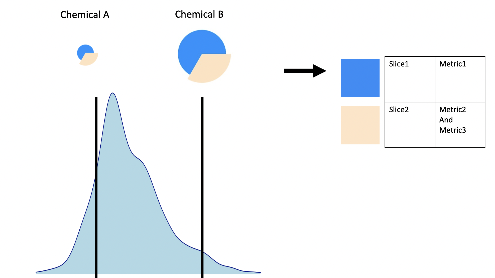

<style type="text/css">

h1.title {
  font-size: 28px;
}
h1 { /* Header 1 */
  font-size: 20px;
}
h2 { /* Header 2 */
    font-size: 20px;
}
h3 { /* Header 3 */
  font-size: 18px;
}
h4 { /* Header 4 */
  font-size: 16px;
   color: DarkBlue;
}
code.r{ /* Code block */
    font-size: 12px;
}
</style>


```{r setup, include = FALSE}
knitr::opts_chunk$set(
  collapse = TRUE,
  comment = "#>"
)
```

## Introduction

This document introduces ToxPi and describes how to use the `toxpiR` package to easily import, recombine, analyze, and visualize high dimensional data. The `toxpiR` package is an R implementation of ToxPi that offers new features over what was previously available for data handling, recombination, and customization; provides formally packaged, open-source code for ToxPi; extends the application domain by supporting rapid analysis of massive datasets; and bridges with the stand-alone, [Graphical User Interface (GUI)](https://toxpi.org) Java application and [ArcGIS Toolkit](https://github.com/Jonathon-Fleming/ToxPi-GIS). 

## What is ToxPi?

Toxicological Priority Index (ToxPi) is a decision support tool that allows transparent integration and visualization of data across disparate information domains to aid in prioritization. ToxPi takes input data of disparate sources,from a biological assay or a computer predicted model,to genetic features or proteomic data, and combines all of these data types into one overall model. This model then calculates an overall score for each datapoint of interest. It does this by the user specifying one or more features to go into each "slice" of a unit circle, and the weights that these slices have. These slices can contain one or more features of any type in the same slice. The slice weights are user defined, and decided based on prior information that one may have about the analysis. When a slice has a higher weight, it takes up more room on the unit square. When a slice has a higher calculated score, it goes further out from the center of the circle. As shown below, a feature with a low score will have overall smaller slices than one with an overall higher score. This means that we can understand at a glance the top level differences between what we are interested in. The component slices also add up to the overall ToxPi score with the weights add importance to that specific slice. The metrics that make up each component slice are simulated in data in this case, but can be many different kinds of data that fits your own analysis. More information on the methodological details can be found at [toxpi.org](https://toxpi.org).   

<center>
{width=700px}

</center>

## Outline

There are three main steps in using this package: 

- **Loading data**: Users can load comma-separated value (csv) formatted data where data features that will make up the slices are stored as columns and attributes are rows. If you are more famililar with the GUI data format, the package also has a function to load data that is formatted in any one of the GUI layouts where slice information is presented in rows beginning with a hash tag(#). However, new users should use a simple .csv file with the row and column layout.  

- **Creating ToxPi Model**: ToxPi model can be created by specifying information about each slice and its corresponding weights. Each slice can be made up of one or more features from the input data. You should also name the slices and provide their weights in this step.

- **Computing ToxPi Scores**: Scores can be computed per attribute as well as for each slice. The S4 object resulting from this step will combine and store the ToxPi model and scores all in one place. This final object will contain all the information needed for plotting. 

Data contained within different slots of the S4 objects created using this package can be obtained using *accessor functions*. More details on how this can be done is present later in the document. 


## Installation

### **Standard installation**

You can install `toxpiR` from [CRAN](https://cran.r-project.org/web/packages/available_packages_by_name.html) with:

```{r, eval = FALSE}
install.packages("toxpiR")
```

### **Installation from GitHub**

Any new features will be first added to the GitHub version of the package. However, it may be less stable than the release on CRAN. Before attempting a direct installation from GitHub, please make sure you have `devtools` package on your system. 
Note, Windows users will need Rtools to install directly from GitHub. 
 
```{r, eval = FALSE}
remotes::install_github("ToxPi/toxpiR")
```

## **Launching package in R**

```{r packages, warning=FALSE}
library(toxpiR)
```


## Flowchart 
<center>
{width=700px}
</center>

This flowchart details the basic steps necessary to analyze data using `toxpiR`. A separate vignette describes how load and work with the GUI data file using txpImportGui() function. Usage for all other functions is described below using an example data set. To view a list of all functions available in this package, please run:  
  
> lsf.str("package:toxpiR")   

## Example usage

Data can either be entered as a regular csv file without the header lines specifying slice information, or in one of the GUI input formats. If you are using the GUI format, please refer to the [Import ToxPi GUI files](https://cran.r-project.org/package=toxpiR/vignettes/importFromGui.html) vignette. 

The standard data input is a standard R dataframe with rows as your datapoints and columns as features that may be turned into ToxPi slices. A simple example data set called *txp_example_input* is available within the package. We will use this 10 x 8 toy data to walk through a simple analysis and explain the functions available in this package. These metrics that we have specified can be in completely different scales and data type, but first we will show a simple example of the package usage.


### Load the dataset

```{r }
data(txp_example_input, package = "toxpiR")
head(txp_example_input)
```

### Specify slice information 

The first step is to specify information about each slice before creating a Toxpi model. This can be done using the **TxpSliceList()** and **TxpSlice()** functions. These slices can be made up of one or more features from the input dataset and are specified by listing the features that go into each slice in the **TxpSlice()** function. We can also specify how we want to transform the slices with the  **TxpTransFuncList()** function. This means we can do a different transformation per slice instead of having to transform the entire input dataset. 


#### TxpSlice(txpValueNames, txpTransFuncs)

>Store individual slice objects. 

**Arguments**

> *txpValueNames* : character vector indicating which data to include in the slice. Can just be the name of a single column if that is all the slice contains.

> *txpTransFuncs* : List of transformation functions to use with one function per entry in txpValueNames. Can be created using TxpTransFuncList() method. Defaults to NULL. 

#### TxpSliceList()

>Method to merge all individuals slices together and assign slice names.

**Basic Usage**


```{r }

## Goal - Create two slices with transformation functions 
# Slice 1: Metric 1, No transformation 
# Slice 2: Metric 2 (square) and Metric 3 (no transformation)

slice2.trans <- TxpTransFuncList(func1 = function(x) x^2, func2 = NULL)

f.slices <- TxpSliceList(Slice1 = TxpSlice("metric1"), 
                         Slice2 = TxpSlice(c("metric2", "metric3"), 
                                           txpTransFuncs = slice2.trans ))

```

### Create ToxPi model

The ToxPi model object is core for specifying how the created slices should behave when the scores are calculated. In this step, we need to specify what the slices we created above are and assign those slices weights. We can also assign transformation functions at this step. However, it is not necessary if you have already done so when creating the slices. The model is a core component of the analysis because it is going to specify how our calculations are performed. 

#### TxpModel()

**Arguments**

> *txpSlices* : TxpSliceList() object.

> *txpWeights* : numeric vector specifying weight of each slice. By default, all slices are weighted equally (1). 

> *txpTransFuncs* : TxpTransFuncList object. Defaults to NULL, if a list is provided, its length must be equal to the number of slices present.

> adjusted : Scalar logical to adjust returned weights such that they sum to 1. 


**Usage**

```{r }

## Goal - Create ToxPi model.
# Slice 1, weight = 2
# Slice 2, weight = 1, apply log transform to final value. 

# Object storing list of transformation functions.
final.trans <- TxpTransFuncList(f1 = NULL, f2 = function(x) log10(x)) 

f.model <- TxpModel(txpSlices = f.slices, 
                    txpWeights = c(2,1),
                    txpTransFuncs = final.trans)

```

### Calculate ToxPi scores

Calculate ToxPi Scores for the given ToxPi model and input data. This input data is what we read in previously from either a standard .csv file or a GUI compatible one. This step uses the model we have created to specify how the ToxPi scores should be calculated. The results object that is created also stores the model used, allowing for easy reference when you are dealing with many models and results.

#### txpCalculateScores()

**Arguments**

> *model* : ToxPi model object created using TxpModel() function.

> *input* : dataframe containing input data for ToxPi model. 

> *id.var* : Character scalar, column in 'input' to store in. Deafults to NULL.

> *rank.ties.method* : character string specifying how ties are treated. Available options "average", "first", "last", "random", "max" and "min". Pased to base::rank function.

> *negative.value.handling* : character string specifying how negative values are treated. Available options are "keep" and "missing". Defaults to keep. 

**Usage**

```{r }
f.results <- txpCalculateScores(model = f.model, 
                                input = txp_example_input,
                                id.var = 'name' ) 

txpSliceScores(f.results) #ToxPi scores
txpWeights(f.results) #Print weights
```


### Plotting 

Basic ToxPi visuals and rank plots can be created using the plot() function. Ranks are calculated such that the highest ToxPi score has a rank of 1. Advanced grid graphics can be implemented using pieGrob objects that are compatible with the grid system. Additional plots can be made such as a rank plot by using the data stored in the results object. The results object also allows for the flexibility to use other R plotting packages if preffered. 

```{r fig.width=7, fig.height=3}
library(grid) # Load library
plot(f.results) # ToxPi visuals
# grid.ls() #List grid info

# Highlight one figure using its label
grid.edit("pie-1", fills = c("red", "black"))

# Or just one slice in a figure
grid.edit("pie-10::slice1", gp = gpar(fill = "#7DBC3D"))
```

```{r fig.width=5, fig.height=4}
# Rank plot
plot(f.results, y = txpRanks(f.results), labels = 1:10)

# Hierarchical Clustering

f.hc <- hclust(dist(txpSliceScores(f.results)))

plot(f.hc, hang = -1, labels = txpIDs(f.results), xlab = '', sub = '')
```


## Citation

To cite `toxpiR` in your work, please use: 
https://cran.r-project.org/package=toxpiR (Manuscript currently in review)
